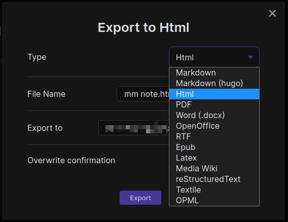
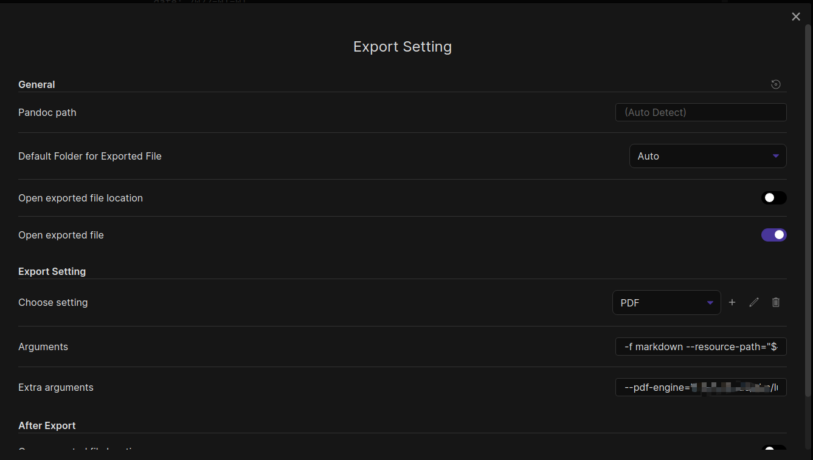

# Obsidian Enhancing Export Plugin

English | [中文](./README_zh-CN.md)

This is an enhancing export plugin base on `Pandoc` for Obsidian ([https://obsidian.md/](https://obsidian.md/)). It's allow you to export to formats like `Markdown`、`Markdown (Hugo)`、`Html`、`docx`、`Latex` etc.

Where `Markdown`、`Markdown (Hugo)`、`Html` will export and its media resource together.

**Note：**  `Markdown`、`Markdown (Hugo)`、`Html` are tested in Mac OS、Window、Linux as I used it for myself, others are not tested well.

## Screen shot

- Export view，click on `Export to ......` on file menu.
  
- Setting view
  

## Installation

1. First install `pandoc` , and then add `pandoc` path to environment variable `PATH` or set absolute path of `pandoc` in the plugin setting view.

   See more details in [https://pandoc.org/installing.html](https://pandoc.org/installing.html)。

2. Search `obsidian-enhancing-export` in the community plugin of obsidian, and install it.

## Customize export commands

You can customize your export command by yourself, click `add` in the plugin setting view and then choose template `custom` to add new custom configuration.

## Variables 

You can use `${variables}` in custom export command, their values are:

| Key                      | Value                                                        |
| ------------------------ | ------------------------------------------------------------ |
| `${outputPath}`          | Output file path after export. For example， if your export to location `/User/aaa/Documents/test.pdf`, then `${outputDir}`  will be replace that path. |
| `${outputDir}`           | Output directory of saved exported file，It will be `/User/aaa/Documents` in above case. |
| `${outputFileName}`      | File name (without extension)  of the saved exported file. It will be `test` in above case. |
| `${outputFileFullName}`  | File name (with extension)  of the saved exported file. It will be `test.pdf` in above case. |
| `${currentPath}`         | Path of currently edited file. For example, if your are editing `/User/aaa/Documents/readme.md`, the the value will be `/User/aaa/Documents/readme.md`. |
| `${currentDir}`          | Current directory of currently edited file, It will be`/User/aaa/Documents` in above case. |
| `${currentFileName}`     | Filename without extension of currently edited file, It will be `readme` in above case. |
| `${currentFileFullName}` | Filename with extension of currently edited file. It will be `readme.md` in above case. |

## Finally

- Welcome to provide more command templates to [here](src/export_command_templates.ts).
- Feel free to file an issue for any questions.